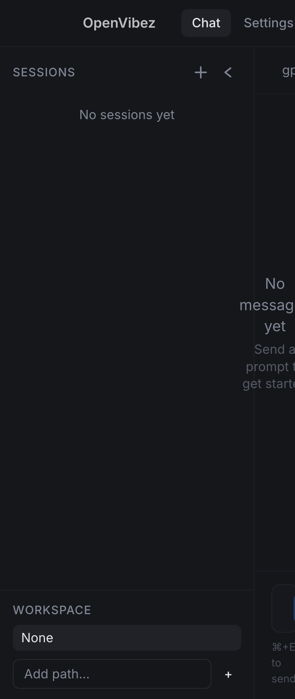
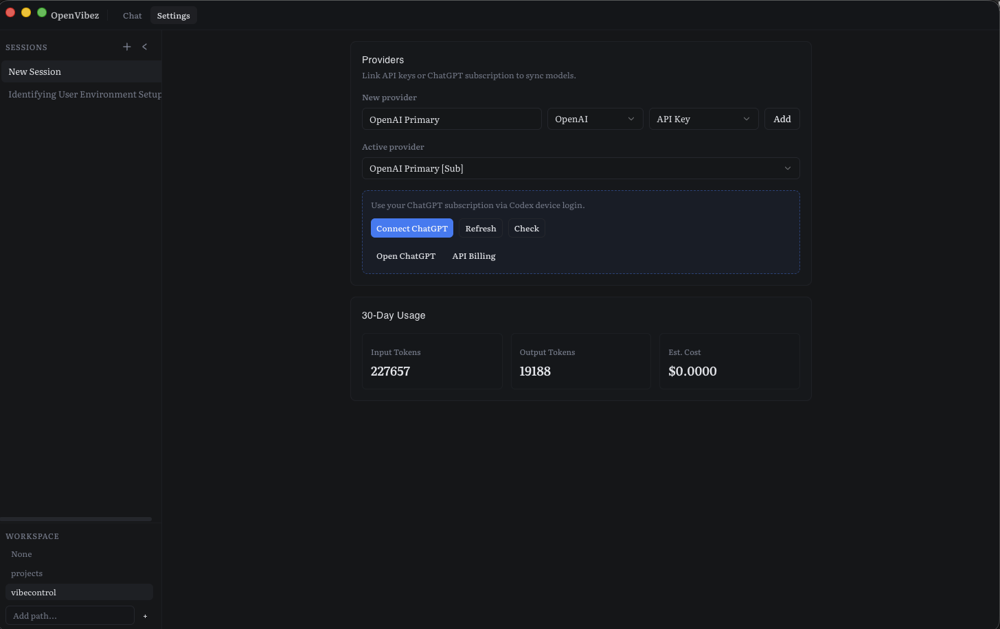

# OpenVibez

A local-first, privacy-respecting AI coding assistant for your desktop. Built with Electron, React, and TypeScript.

OpenVibez gives you a native chat interface that connects to the AI providers you already pay for — no middleman, no cloud relay, no telemetry. Your keys stay in your OS keychain, your data stays in a local SQLite database, and your conversations never leave your machine.




> **Status:** Early alpha. Core chat loop works with OpenAI API keys, ChatGPT subscriptions, and local Ollama models, including autonomous local CLI execution and cancellable runs.

> [!WARNING]
> **This is very early alpha software.** I've directed the vision, but fully embraced the vibes while building it — and it shows. OpenVibez has direct CLI access and can be given root execution privileges. **I take zero responsibility** for what happens if you hand it the keys to your system. This is a fun experiment, not production software. Use at your own risk.

---

## Why OpenVibez

Most AI coding tools lock you into a single provider, route your code through their servers, or charge a markup on top of API costs. OpenVibez takes a different approach:

- **Bring your own keys** — connect any provider directly, pay API prices
- **Local-first** — SQLite database, OS keychain for secrets, zero cloud dependency
- **Multi-provider** — use different models for different tasks in the same session
- **Stream-first** — real-time streaming with thought/plan/action trace visibility
- **Workspace-scoped** — attach project directories and control execution scope (sandboxed or root)

---

## Architecture

```
openvibez/
├── apps/desktop/          # Electron desktop app
│   ├── src/main/          # Main process (IPC, DB, providers, keychain)
│   ├── src/preload/       # Context bridge + type contracts
│   └── src/renderer/      # React UI (Vite + Tailwind + Radix)
├── db/                    # Drizzle ORM schema + migrations
│   └── schema/tables/     # providers, sessions, messages, models, usage, jobs
└── packages/shared/       # Shared types and utilities
```

**Main process** handles all sensitive operations — keychain access, database queries, API calls to providers, and subprocess management for Codex CLI integration. The renderer never touches secrets or makes network requests directly.

**Renderer** is a React SPA with Zustand for state, Radix UI primitives, and Tailwind CSS. Communication with main happens exclusively through typed IPC channels exposed via `contextBridge`.

**Database** is SQLite via `better-sqlite3` + Drizzle ORM, stored in the Electron user data directory. Schema covers providers, sessions, messages, model profiles, workspace projects, usage events, app settings, and background jobs.

---

## Getting Started

```bash
# Clone and install
git clone https://github.com/your-org/openvibez.git
cd openvibez
npm install

# Run in development
npm run dev

# Build for production
npm run build

# Type check
npm run typecheck

# Database migrations
npm run db:generate
npm run db:studio
```

### Connect a provider

1. Launch the app and go to **Settings**
2. Add a provider (OpenAI API Key, ChatGPT Subscription, or Local/Ollama)
3. For OpenAI API key: paste your key, hit **Save + Test**
4. For subscription: click **Connect ChatGPT** and complete the device login flow
5. For Ollama: select **Local (Ollama)** and use **Test Default** (or save a custom endpoint URL)
6. Models sync automatically on successful connection

### Environment variables

| Variable | Description |
|---|---|
| `OPENVIBEZ_DEVTOOLS` | Set to `1` to auto-open DevTools on launch |
| `OPENVIBEZ_CODEX_BIN` | Absolute path to Codex CLI binary (for subscription mode) |

---

## Robustness Program (Phases 1-3)

The roadmap in [docs/ROBUSTNESS_PROPOSALS.md](docs/ROBUSTNESS_PROPOSALS.md) is now implemented through Phase 3.

### Phase 1 (core reliability)

- **Provider runner split** — chat orchestration now routes through a stable runner contract (`OpenAI`, `Codex`, `Local/Ollama`) instead of one monolithic provider loop.
- **OpenAI SDK-first path** — OpenAI completions use official SDK event handling for streaming and usage capture.
- **Hard command policy enforcement** — shell calls are guarded by workspace trust + access mode rules (scoped cwd enforcement, read-only mutation blocking, root restricted to trusted workspaces).
- **Idempotent send/run flow** — `clientRequestId` + `assistant_runs` uniqueness prevent duplicate user/assistant rows during retries and races.

### Phase 2 (durability + provider controls)

- **Durable run journal** — `assistant_runs` lifecycle and recovery flow handle restart reconciliation for interrupted runs.
- **Codex execution controls** — approval policy and optional JSON output schema are configurable and enforced in Codex execution.
- **Ollama native tools-first execution** — native tool calling is attempted first, with protocol fallback retained for weaker local models.
- **Trace/event normalization** — provider traces and streamed deltas map consistently into the shared timeline feed.

### Phase 3 (flagged pilots)

- **OpenAI background mode pilot** — optional background response execution with persisted `background_jobs` state and polling recovery.
- **Background scheduler** — main-process scheduler resumes/finishes active OpenAI background jobs after restarts.
- **Codex SDK pilot** — optional SDK path is available behind a setting, with CLI integration kept as default fallback.
- **Webhook verification helper** — OpenAI webhook unwrap helper is included for signature-verified event ingestion paths.

### Operational notes

- OpenAI background mode and Codex SDK pilot are opt-in in Provider Settings.
- Default behavior remains conservative: OpenAI streaming and Codex CLI paths stay available as fallback.

---

## What's Built

- [x] Electron shell with frameless macOS title bar and native drag region
- [x] Provider management — create, configure, test connections
- [x] API key auth with OS keychain storage (keytar)
- [x] ChatGPT subscription auth via Codex CLI device login
- [x] Local model support via Ollama (default `http://127.0.0.1:11434`)
- [x] Local CLI tool execution loop (`run_shell`) with multi-step autonomous task completion
- [x] Ollama native tool-calling path with protocol fallback
- [x] Plan/checklist enforcement for local agent runs
- [x] Model discovery — auto-sync available models from provider
- [x] Session management — create, switch, persist conversations
- [x] Streaming chat with real-time text deltas
- [x] Trace visualization — thought, plan, and action traces during execution (inline in message feed)
- [x] Cancel in-flight requests (OpenAI, Codex, and local/Ollama)
- [x] Provider runner architecture (`OpenAI`, `Codex`, `Local/Ollama`)
- [x] Command policy enforcement for workspace trust/access modes
- [x] Send idempotency via `clientRequestId` + durable `assistant_runs`
- [x] Restart recovery for interrupted runs
- [x] Workspace scoping — attach project directories, control execution sandbox
- [x] Scoped vs root execution modes
- [x] Token usage tracking with 30-day cost summary
- [x] SQLite persistence for all data (Drizzle ORM)
- [x] OpenAI background jobs (`background_jobs`) + scheduler recovery
- [x] Codex approval policy + output schema controls
- [x] Codex SDK pilot toggle (CLI fallback retained)

---

## Roadmap

### Multi-Provider Support

The type system already supports `openai | anthropic | local` provider types. Next up:

- **Anthropic / Claude** — Direct API integration with Claude 4 family models. Same key-in-keychain pattern as OpenAI.
- **Google Gemini** — API key auth, model sync, streaming completions.
- **OpenRouter** — Single key, access to 100+ models from every major provider.
- **Advanced Local / Ollama** — richer local runtime controls (per-provider endpoint presets, model options, and diagnostics).
- **Custom OpenAI-compatible** — Any endpoint that speaks the OpenAI chat completions API (LM Studio, vLLM, text-generation-webui, etc.)

### Agent Capabilities

- Tool use and function calling with approval flow
- File read/write with diff preview
- Terminal command execution (sandboxed by workspace scope)
- Multi-step autonomous runs with pause/resume
- Trace-driven debugging — replay thought/plan/action sequences

### UX

- Markdown rendering with syntax highlighting in messages
- Code block copy and apply-to-file actions
- Conversation search and filtering
- Session branching (fork a conversation at any message)
- Keyboard-first navigation
- System prompt management per session or workspace

### Infrastructure

- Auto-updater (electron-updater)
- Crash reporting (opt-in)
- Plugin system for custom providers and tools
- CLI companion for headless usage

---

## Tech Stack

| Layer | Technology |
|---|---|
| Shell | Electron 39 |
| Renderer | React 19, Vite 7, TypeScript 5.9 |
| Styling | Tailwind CSS 3.4, Radix UI, CVA |
| State | Zustand 5 |
| Database | SQLite (better-sqlite3), Drizzle ORM |
| Secrets | OS Keychain (keytar) |
| IPC | Electron contextBridge with typed contracts |

---

## License

MIT
