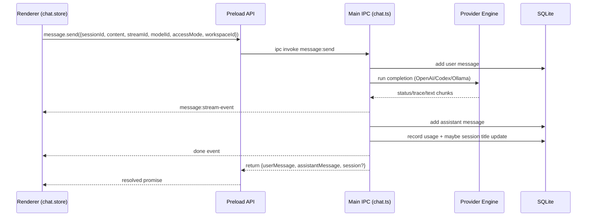

# OpenVibez Low-Level Architecture (Current Implementation)

## 1. Scope

This document describes how OpenVibez currently handles the core chat flow end-to-end, including provider execution, streaming, cancellation, local tool-calling, persistence, and renderer synchronization.

It reflects the current code in `apps/desktop` and focuses on implementation details, not planned behavior.

## 2. System Boundaries

### Process split

- Main process: all privileged operations (DB, keychain, provider network/CLI, shell execution, IPC handlers).
- Preload: typed IPC bridge (`window.openvibez`) via `contextBridge`.
- Renderer: React + Zustand UI/state; no direct DB/network/keychain access.

Key files:

- `apps/desktop/src/main/window.ts`
- `apps/desktop/src/main/index.ts`
- `apps/desktop/src/preload/index.ts`
- `apps/desktop/src/renderer/features/chat/chat.store.ts`

Security-critical window flags (enabled):

- `contextIsolation: true`
- `nodeIntegration: false`
- preload-only API exposure

## 3. Runtime Bootstrap

Startup sequence (`apps/desktop/src/main/index.ts`):

1. `app.whenReady()`
2. `initDb()`
3. `registerIpcHandlers()`
4. `startJobScheduler()`
5. `createMainWindow()`

IPC registration fan-out (`apps/desktop/src/main/ipc/index.ts`):

- providers
- chat/session/message
- workspaces
- settings/usage
- system shell open

## 4. Persistence and Local State

### SQLite

The runtime DB uses `better-sqlite3` with direct SQL migration in `apps/desktop/src/main/services/db.ts`.

Pragmas:

- `journal_mode = WAL`
- `foreign_keys = ON`
- `synchronous = NORMAL`

DB file path: `app.getPath('userData')/openvibez.db`.

Core tables:

- `providers`
- `model_profiles`
- `workspace_projects`
- `sessions`
- `messages`
- `usage_events`
- `app_settings`
- `background_jobs`

### Keychain

Secrets are stored under service `OpenVibez` via `keytar` (`apps/desktop/src/main/services/keychain.ts`).

Fallback behavior: if `keytar` fails to load, secrets are stored in an in-memory map for the current process only.

## 5. IPC Contract Surface

Renderer accesses only `window.openvibez` methods from preload:

- provider: create/list/save secret/test/start login/get login state/list/refresh models
- session: create/set provider/list/archive
- message: send/cancel/list + stream event subscription
- workspace: add/list
- settings: get/set
- usage: summary
- system: open external URL

Validation is done in main process via Zod (`apps/desktop/src/main/ipc/contracts.ts`).

## 6. End-to-End Chat Flow

### High-level sequence

### Detailed send path (`apps/desktop/src/main/ipc/chat.ts`)

1. Validate input (`messageSendSchema`).
2. Resolve session and create/track `streamId` + `AbortController` in `inflightRequests`.
3. Emit status `Queued`.
4. Load existing messages, persist user message immediately.
5. Resolve provider/session/workspace/model context.
6. Execute provider-specific completion path.
7. Stream incremental events back to renderer (`status`, `trace`, `text_delta`, `error`, `done`).
8. Persist assistant message (including token usage when available).
9. Optionally auto-generate session title.
10. Mark provider last-used and record usage event.
11. Emit `done`, return message payload, remove inflight entry.

Important behavior:

- User message is committed before provider call.
- Assistant message is always committed, including cancellation/error text.
- `message:send` is long-running; live UX is driven by stream events, not the invoke return.

## 7. Provider Execution Paths

## 7.1 OpenAI API key mode

File: `apps/desktop/src/main/services/providers/openai.ts`

- Uses `POST https://api.openai.com/v1/responses` with `stream: true`.
- Parses SSE events, especially:
  - `response.output_text.delta` for text chunks
  - `response.completed` for final usage/model
- If streaming produced no text, retries with `stream: false` fallback.
- Exposes `testOpenAIConnection` (`/v1/models`) and `listOpenAIModels`.

## 7.2 OpenAI subscription mode (Codex CLI)

File: `apps/desktop/src/main/services/providers/codex.ts`

- Auth/login handled through `codex login --device-auth` and `codex login status`.
- Completion runs via `codex exec --json --output-last-message <tmpfile>`.
- Access mode mapping:
  - scoped: `--sandbox workspace-write`
  - root: `--dangerously-bypass-approvals-and-sandbox`
- Parses JSON line events from Codex stdout:
  - reasoning -> `trace` (thought/plan)
  - action/tool items -> `trace` with `actionKind`
  - agent messages -> assistant text deltas
- Final assistant output read from tmp message file (fallback to streamed agent text).

## 7.3 Local/Ollama mode

Files:

- `apps/desktop/src/main/services/providers/ollama.ts`
- `apps/desktop/src/main/ipc/chat.ts`

Model calls:

- `POST /api/chat` on configured Ollama base URL
- supports stream and non-stream modes
- model listing via `GET /api/tags`

For normal single-turn completions, Ollama supports simple streaming. For autonomous tool flow, OpenVibez layers a strict protocol on top (below).

## 8. Local Tool-Calling Protocol (Ollama Autonomous Loop)

Implemented in `apps/desktop/src/main/ipc/chat.ts`.

Protocol prefixes:

- `PLAN {"steps":[...]}`
- `TOOL_CALL {"name":"run_shell","arguments":{"command":"...","cwd":"..."}}`
- `STEP_DONE {"index":1,"note":"..."}`
- `FINAL {"message":"..."}`

Execution model:

1. Inject strict system prompt describing required protocol.
2. Force planning stage first (up to 2 attempts).
3. Maintain checklist state (`MAX_LOCAL_PLAN_STEPS = 12`).
4. Iterate up to `MAX_LOCAL_TOOL_STEPS = 24`:
   - request next model turn
   - accept exactly one of: tool call, step done, final
   - reject invalid protocol and continue
5. Run tool calls through `run_shell` only.
6. Require all checklist items complete before accepting `FINAL`.

Shell tool behavior:

- command execution uses `spawn(..., { shell: true })`
- timeout: `120000 ms`
- output capped to `20000` chars
- tool result is sent back to model as `TOOL_RESULT <json>` system message
- traces emitted to renderer for command and command-result

Access/cwd behavior:

- working directory defaults to selected workspace path or process cwd
- relative tool cwd is resolved against workspace/base
- absolute cwd is accepted as-is (resolved)

## 9. Streaming Event Model

Event type (`preload/types.ts`):

- `status`
- `trace`
- `text_delta`
- `error`
- `done`

Main emits via `event.sender.send('message:stream-event', payload)`.

Renderer behavior (`chat.store.ts`):

- listener is installed once (`ensureStreamListener`)
- ignores stream events not matching active `{streamId, sessionId}`
- keeps:
  - accumulating text
  - per-session trace history
  - per-session status trail
  - timeline interleaving trace and text blocks for UI

Message rendering (`MessageList.tsx`):

- parses trace/action payloads into higher-level UI cards:
  - commands
  - command results (exit/stdout/stderr)
  - checklist updates
  - file edits/search summaries

## 10. Cancellation and Interrupt Semantics

Main process:

- `message:cancel` looks up stream in `inflightRequests` and aborts controller.
- provider/shell runners honor abort signal and terminate subprocesses.

Renderer (`chat.store.ts`):

- if send occurs while another stream is active:
  1. call cancel
  2. wait until stream settles or 4s timeout
  3. start new send

Error/cancel persistence behavior (`chat.ts`):

- cancellation stores partial assistant text if available, else `Request cancelled.`
- provider failures store `Provider request failed: <reason>`

## 11. Workspace and Access Mode

Workspace selection:

- renderer stores selected workspace
- sent with `message:send`
- main resolves root path from `workspace_projects`

Access mode choices:

- `scoped` or `root`
- used strongly in Codex path (sandbox vs bypass)
- used as prompt context in local/Ollama path

Trust level (`trusted`, `read_only`, `untrusted`) is currently stored for workspaces but not actively enforced in execution paths.

## 12. Session Title Generation

After assistant message write, title can be auto-generated if:

- first message in session OR current title matches placeholder pattern
- assistant response is non-empty and not error/cancel boilerplate

Generation is provider-backed (`chat.ts -> generateSessionTitle`):

- compact prompt using clipped user/assistant text windows
- title sanitized to single line, compact whitespace, max 80 chars

## 13. Model Discovery and Defaults

Provider model synchronization (`ipc/provider.ts` + `services/db.ts`):

- OpenAI key mode: list OpenAI models
- OpenAI subscription mode: list Codex available models from cache
- Local mode: list Ollama tags
- replaced atomically per provider (`replaceProviderModelProfiles`)
- default model preference uses priority list

Runtime model resolution on send:

- explicit request modelId
- else session model profile
- else app default setting
- else hardcoded fallback

## 14. Key Architectural Decisions

1. Main-process authority for all sensitive actions
- Keeps secrets, DB, CLI execution out of renderer.

2. Streaming-first UI with long-running IPC invoke
- Single invoke call returns final persisted messages.
- Separate pub/sub stream channel drives live UX.

3. Provider abstraction at call-site rather than plugin framework
- `chat.ts` branches directly by provider/auth kind.
- Fast to ship, but main handler is large and owns too much policy.

4. Protocol-constrained local tool calling
- Deterministic text protocol (`PLAN/TOOL_CALL/STEP_DONE/FINAL`) to keep local model behavior bounded and parseable.

5. Soft scoping for local shell path
- Workspace path + prompt guidance steer behavior.
- No OS-level sandbox enforcement for local `run_shell` path.

6. Persist everything as conversation records
- Even cancellation/error outcomes are stored as assistant messages.

## 15. Known Gaps / Technical Debt

1. Local access-mode enforcement
- `root/scoped` is not a hard sandbox for local shell execution.

2. Workspace trust-level not enforced
- trust metadata exists but does not gate commands/file access.

3. Large orchestration function
- `ipc/chat.ts` carries session logic, provider selection, local agent protocol, shell runtime, and persistence.

4. Duplicate schema sources
- Shared IPC schemas exist in `packages/shared/src/contracts/ipc.ts`, but main process uses `apps/desktop/src/main/ipc/contracts.ts` directly.

5. Background scheduler stub
- scheduler currently initializes/logs only.

6. Usage cost
- cost microunits recorded as `0` for completions currently.

## 16. Extension Points

Recommended seams for next refactors:

- Extract provider execution strategy interface from `chat.ts`.
- Isolate local tool-runner to dedicated service with pluggable tools.
- Enforce workspace trust/access at command execution boundary.
- Unify contract definitions (single source of truth shared package).
- Add durable run records for tool iterations (instead of trace-only stream).

## 17. Quick File Map

- App bootstrap: `apps/desktop/src/main/index.ts`
- Window security boundary: `apps/desktop/src/main/window.ts`
- IPC registration: `apps/desktop/src/main/ipc/index.ts`
- Chat/session/message orchestration: `apps/desktop/src/main/ipc/chat.ts`
- Provider IPC handlers: `apps/desktop/src/main/ipc/provider.ts`
- DB + migrations-at-runtime: `apps/desktop/src/main/services/db.ts`
- Keychain integration: `apps/desktop/src/main/services/keychain.ts`
- OpenAI adapter: `apps/desktop/src/main/services/providers/openai.ts`
- Codex adapter: `apps/desktop/src/main/services/providers/codex.ts`
- Ollama adapter: `apps/desktop/src/main/services/providers/ollama.ts`
- Preload bridge: `apps/desktop/src/preload/index.ts`
- Renderer store/state machine: `apps/desktop/src/renderer/features/chat/chat.store.ts`
- Stream/trace renderer: `apps/desktop/src/renderer/features/chat/MessageList.tsx`
